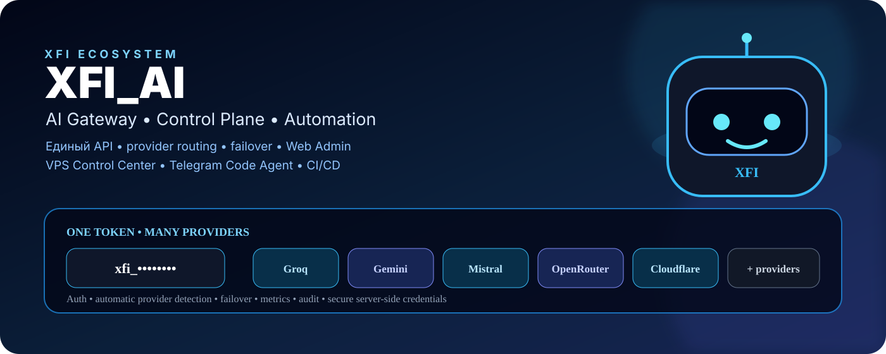
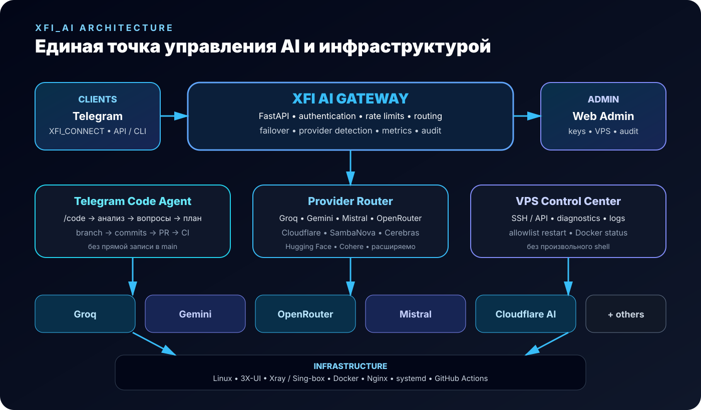

# XFI AI

<p align="center">
  
</p>

<p align="center">
  <strong>AI Gateway и control-plane экосистемы XFI</strong><br>
  Единый API, маршрутизация между AI-провайдерами, failover, Web Admin, VPS Control Center и Telegram Code Agent.
</p>

<p align="center">
  
  
  
  
</p>

> **XFI_AI** — единая точка для AI-запросов, автоматизации, управления VPS и безопасной разработки XFI CONNECT.

## Что делает XFI AI

- единый API для нескольких AI-провайдеров;
- автоматический provider failover;
- выпуск и управление клиентскими `xfi_...` API keys;
- автоматическое определение provider по неизвестному API key;
- Web Admin для ключей, VPS и аудита;
- диагностика VPS и ограниченный безопасный restart разрешённых сервисов;
- OpenClaw control-plane для Telegram и auto-heal сценариев;
- Telegram Code Agent, который понимает обычные текстовые задачи и правит XFI CONNECT после уточняющих вопросов и подтверждения;
- работа Code Agent только через отдельную ветку и Pull Request;
- единый реестр интеграций **XFI_CONNECT** и **XFI_3XUI_WebApp**.

## Архитектура

<p align="center">
  
</p>

```text
XFI_CONNECT ───────────────┐
Telegram / VPN / Support   │
                            ├──► XFI AI Gateway ──► AI Providers
XFI_3XUI_WebApp ───────────┤            │
Mini App / Web Admin       │            ├──► Provider failover
                            │            ├──► Client API keys
OpenClaw / Code Agent ─────┘            └──► Metrics / Audit
```

Архитектура построена вокруг одного XFI token: клиентам не требуется знать ключи конкретных AI-провайдеров, а provider credentials остаются на серверной стороне.

## Интеграции XFI

### XFI_CONNECT

[XFI_CONNECT](https://github.com/deilja/XFI_CONNECT) использует XFI AI Gateway как единый AI backend для Telegram VPN-бота и support workflow.

- один клиентский `xfi_...` token;
- `/ai` для AI-помощника;
- `/ai_token` для безопасной настройки Gateway;
- реальные ключи Groq/Gemini/OpenRouter и других providers не хранятся в XFI_CONNECT;
- Telegram Code Agent использует отдельный контролируемый workflow через branch → commit → Pull Request → CI.

### XFI_3XUI_WebApp

[XFI_3XUI_WebApp](https://github.com/deilja/XFI_3XUI_WebApp) использует XFI AI для административной AI-диагностики VPN-узлов.

- Telegram Mini App и Web Admin остаются независимым приложением;
- XFI AI вызывается сервер-сервер через `XFI_AI_URL` + `XFI_AI_TOKEN`;
- `/api/admin/ai/health` проверяет доступность Gateway;
- `/api/admin/ai/diagnose-node/:id` передаёт AI только безопасные метаданные узла;
- секреты, пароли, токены, UUID и приватные ключи в AI-контекст не передаются;
- поддерживаются диагностика 3X-UI/Xray и Phobos-сценариев.

### Реестр интеграций

Администратор XFI AI может получить безопасный снимок подключений:

```text
GET /admin/integrations
```

Endpoint показывает только наличие URL/token и список capabilities. Сами URL и секреты не возвращаются.

Для внешних клиентов предусмотрены отдельные переменные:

```env
XFI_CONNECT_URL=
XFI_CONNECT_AI_TOKEN=
XFI_3XUI_WEBAPP_URL=
XFI_3XUI_WEBAPP_AI_TOKEN=
```

Эти переменные нужны именно для отображения статуса интеграции в control-plane; клиентские приложения продолжают использовать свои серверные `XFI_AI_URL`/`XFI_AI_TOKEN`.

## Статус

Production-ready компоненты проходят автоматические GitHub Actions проверки. Gateway, Code Agent и интеграционный слой покрываются тестами, lint и security checks.

## AI-провайдеры

Поддерживаются:

- Groq;
- Google Gemini;
- Cloudflare AI;
- OpenRouter;
- Mistral;
- SambaNova;
- Cerebras;
- Hugging Face;
- Cohere.

Порядок выбора настраивается через `XFI_AI_PROVIDERS`. Для каждого provider учитываются ошибки, cooldown и задержка ответа.

## Автоматическое определение API key

Web Admin может проверить неизвестный ключ:

1. ключ проверяется против поддерживаемых providers;
2. определяется подходящий provider и модель;
3. выводятся только безопасные метаданные: статус, provider, модель, latency и fingerprint;
4. полный ключ функцией автоопределения не сохраняется.

Для Cloudflare нужен `CLOUDFLARE_ACCOUNT_ID`.

## API

```text
GET  /health
GET  /v1/models
POST /v1/chat/completions
GET  /admin/integrations
GET  /admin/keys
POST /api/keys
```

## Telegram Code Agent

Code Agent предназначен для управляемой разработки XFI CONNECT без прямой записи в `main`.

### Цикл изменения

```text
Пользователь → /code → задача → анализ → вопросы → план
                                      ↓
                                 ПОДТВЕРЖДАЮ
                                      ↓
                              branch → commits → PR → CI
```

Code Agent ограничивает размер запроса и файлов, блокирует чувствительные пути (`.env`, credentials, private keys), работает только с безопасными существующими файлами и не должен выполнять произвольные shell-команды.

Основные команды Telegram-бота:

```text
/start
/help
/token
/code
/cancel
```

`/token` выдаёт новый XFI API key. Токен показывается один раз.

## Web Admin

Web Admin предоставляет:

- реестр XFI интеграций;
- выпуск, активацию и деактивацию XFI client keys;
- определение AI provider по API key;
- метрики provider'ов;
- добавление и диагностику VPS;
- безопасный restart разрешённых сервисов;
- просмотр Docker containers;
- audit log.

Административный доступ защищён `XFI_AI_ADMIN_KEY`.

## VPS Control Center

SSH-подключение допускается через существующий ключ или SSH agent. Пароли не принимаются и не сохраняются.

Безопасный restart ограничен allowlist:

```text
x-ui
3x-ui
xray
nginx
docker
```

Произвольные shell-команды, shell injection и destructive-операции через Control Center запрещены.

## OpenClaw + Telegram

OpenClaw используется как отдельный control-plane для диагностики VPS, heartbeat и консервативного auto-heal.

Telegram использует pairing, поэтому неизвестные пользователи не получают доступ автоматически.

Auto-heal допускает только проверку состояния и не более одного безопасного restart с повторной проверкой. Изменение VPN-конфигурации, firewall, DNS, TLS/Reality, пользователей 3X-UI и удаление инфраструктуры автоматически не выполняются.

## Установка

```bash
git clone https://github.com/deilja/XFI_AI.git
cd XFI_AI
bash deploy/preflight.sh
chmod +x deploy/install.sh
sudo ./deploy/install.sh
```

Установщик настраивает Python venv, systemd, nginx reverse proxy, HTTPS, переменные окружения и локальный `/health` smoke test.

Основные пути:

```text
/opt/xfi-ai/
/etc/xfi-ai/xfi-ai.env
/var/lib/xfi-ai/keys.db
/etc/systemd/system/xfi-ai.service
/etc/nginx/sites-available/xfi-ai
```

## Конфигурация

Минимальный набор переменных:

```env
GROQ_API_KEY=
GEMINI_API_KEY=
CLOUDFLARE_API_TOKEN=
CLOUDFLARE_ACCOUNT_ID=
OPENROUTER_API_KEY=
MISTRAL_API_KEY=
SAMBANOVA_API_KEY=
CEREBRAS_API_KEY=
HF_TOKEN=
COHERE_API_KEY=

XFI_AI_PROVIDERS=groq,gemini,cloudflare,openrouter,mistral,sambanova,cerebras,huggingface,cohere
XFI_AI_ADMIN_KEY=
XFI_AI_DB=/var/lib/xfi-ai/keys.db
XFI_AI_KEY_PEPPER=

XFI_CONNECT_URL=
XFI_CONNECT_AI_TOKEN=
XFI_3XUI_WEBAPP_URL=
XFI_3XUI_WEBAPP_AI_TOKEN=
```

Модели можно переопределять через соответствующие `*_MODEL`.

Для OpenClaw дополнительно используются RouterAI/Groq и Telegram credentials.

## Systemd и безопасность

Production service запускается не от root. Используются ограничения systemd:

- `NoNewPrivileges=true`;
- `PrivateTmp=true`;
- `ProtectSystem=strict`;
- `ProtectHome=true`;
- запись только в каталог данных приложения.

Uvicorn слушает localhost, внешний HTTPS отдаёт nginx.

Секреты не должны попадать в Git. Admin key сравнивается constant-time, административные действия пишутся в audit log.

## Тестирование

```bash
python3 -m pytest -q tests
python3 -m compileall -q app
python3 -m ruff check .
bash deploy/preflight.sh
```

GitHub Actions выполняет тесты, lint, security checks, dependency audit и shell validation.

## Связанные проекты

- **XFI_CONNECT** — Telegram VPN-бот и сервис управления подписками, использующий XFI AI Gateway.
- **XFI_3XUI_WebApp** — Telegram Mini App/Web Admin и VPN control-plane с AI-диагностикой через XFI AI.

## Лицензия

Лицензионные условия определяются текущими файлами репозитория.
